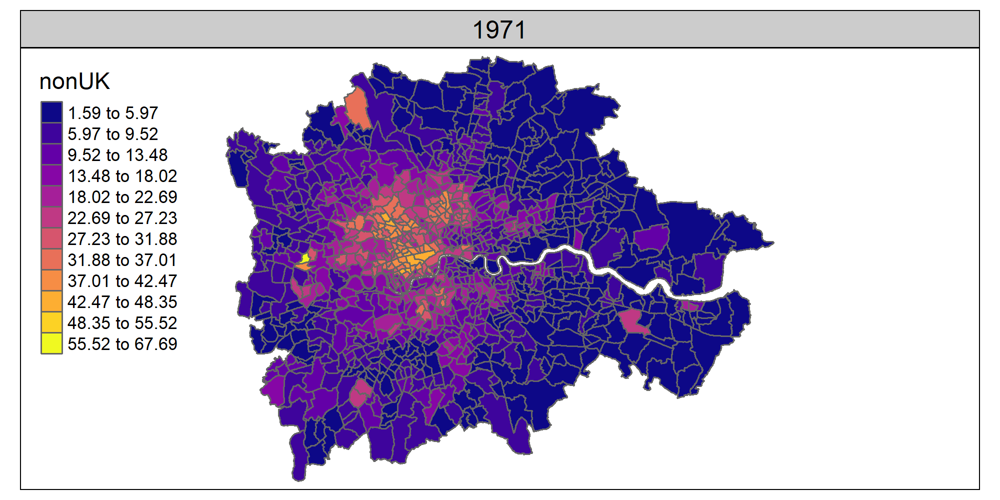

```{r setup, include=FALSE}
knitr::opts_chunk$set(echo=FALSE, cache=FALSE, results=FALSE, warning=FALSE, warning=FALSE, message = F, comment=NA, fig.align='center', fig.width = 10, fig.height = 10, fig.path = "README_figs/")
```

```{r}
library(tidyverse)
library(sf)
library(tmap)
library(knitr)
library(png)
library(grid)

```

# Overview

This repo contains harmonised UK Census **country of birth (CoB)** data for Great Britain, plus other supporting files and code. This page explains what the data is, how it's made, what the rationale is, and what the various other files are.


# Quick start

If you just want to use the data, here's what you need. There are **four** different country of birth CSVs:

* Separate CSVs for Great Britain and Scotland. Separate Scotland CSVs are included as they have a few more country of birth categories (due to differences in 2011 Scottish CoBs).
* For each of those:
    - 3 Census data, 1991, 2001 and 2011 (much larger list of CoBs)
    - 5 Census data, 1971 to 2011 (smaller list of CoBs)
    
Direct links to the files:

* Great Britain:
    - [3 Census](data/countryofbirth/countryOfBirth_GreatBritain_3_Census.csv)
    - [5 Census](data/countryofbirth/countryOfBirth_GreatBritain_5_Census.csv)
* Scotland:
    - [3 Census](data/countryofbirth/countryOfBirth_Scotland_3_Census.csv)
    - [5 Census](data/countryofbirth/countryOfBirth_Scotland_5_Census.csv)

Each CSV contains all Census years in long form. 

The CoBs available in these are:
    
```{r}
gb3 <- read_csv('data/countryofbirth/countryOfBirth_GreatBritain_3_Census.csv')
gb5 <- read_csv('data/countryofbirth/countryOfBirth_GreatBritain_5_Census.csv')
scot3 <- read_csv('data/countryofbirth/countryOfBirth_Scotland_3_Census.csv')
scot5 <- read_csv('data/countryofbirth/countryOfBirth_Scotland_5_Census.csv')
```

**Great Britain 3 Census (1991/2001/2011)**
```{r results = T}
names(gb3[3:ncol(gb3)])
```

**Great Britain 5 Census (1971-2011)**

```{r results = T}
names(gb5[3:ncol(gb5)])

```

**Scotland 3 Census**

```{r results = T}
names(scot3[3:ncol(scot3)])
```


**Scotland 5 Census**

```{r results = T}
names(scot5[3:ncol(scot5)])
```

### Geography

There's a zipped up shapefile in the data folder that matches the **zone** field in the CSVs. It also contains columns for country (England/Scotland/Wales) and [Travel to Work Area](https://www.ons.gov.uk/employmentandlabourmarket/peopleinwork/employmentandemployeetypes/articles/traveltoworkareaanalysisingreatbritain/2016). This is an edited version of 1991 wards/postcode sectors, designed to deal with disclosure issues that removed 1991 data (see below for a full explanation, including the 'merges' column).

An example of this in use, using R:


```{r echo=T, message=F, eval = F, fig.height =  15, fig.width = 10}
library(tidyverse)
library(sf)
library(tmap)

#First Census year here is integer, need to tell read_csv to look past it.
#(read_csv uses first 1000 rows to work out type, by default)
gb5 <- read_csv('data/countryofbirth/countryOfBirth_GreatBritain_5_Census.csv', guess_max = 15000)

#Make % zone proportions so we have percent of CoB per zone
props <- gb5 %>%
  mutate(rowsums = rowSums(select(.,England:`Rest of world`))) %>% 
  mutate_at(vars(England:`Rest of world`), funs(  ((.)/rowsums)*100  )) %>% 
  select(-rowsums)

#Add a column for total of non-UK-born
props <- props %>%
  mutate(nonUK = `Irish Republic`+India+Pakistan+Europe+`Rest of world`)

#Load shapefile
#Unzip first if you haven't already
unzip('data/gb_shapefile/gb_shapefile.zip', exdir = 'data/gb_shapefile')

zones <- st_read('data/gb_shapefile/gb_altered_wards_n_postcodesectors_w_lookup.shp')

#Merge spatial zones with CoB data
join <- left_join(zones,props,by='zone')

#Subset to London TTWA
london <- join %>% filter(ttwa == 'London')

#facet map of London data for non-UK-born
tm_shape(london) +
  tm_polygons(col = 'nonUK', style = 'jenks', n = 12, palette = 'plasma') +
  tm_facets(by = 'censusYear', ncol = 1) 


```

```{r eval = F}
#animation creation
map <- tm_shape(london) +
  tm_polygons(col = 'nonUK', style = 'jenks', n = 12, palette = 'plasma') +
  tm_facets(by = 'censusYear', ncol = 1, nrow = 1) 


tmap_animation(map, filename = 'figs/london.gif', width = 2000, height = 1000, delay = 100)
```

A gif version of the map the above codes produces (see the [rmarkdown file for the gif code](README.Rmd)):




# More detail

### The harmonised country of birth data

The aim of this dataset is to maximise the number of country of birth categories while keeping them identical across Censuses. UK Census data provides tables for people's country of birth with digital access going back to 1971. (See below for more on original data sources.) But neither the geographical zones used **or** the CoB categories are consistent between Censuses. This dataset gives a consistent version, providing an identical geography and CoB category list between Censuses.


The 'lowest common denominator' set of countries each Census has in common is used. The census with the fewest categories imposes its structure on others that may have a more detailed list. Both the 1971 and 1981 censuses contain a much smaller number - so harmonising across five censuses restricts the overall number. 1971 also has a rather colonial structure, with country groups categorised into Commonwealth groups.

Assignment of countries has been made via a careful reading of the country of birth categories in the various Census definition documents. These have all been included as a zip file in the docs folder.

Code is supplied that shows the workings. The code in [scotland_3censusHarmonise](code/scotland_3censusHarmonise.R) is a good example. Where exact matches can be found across all three (once any differences in naming are dealt with) these are kept. For larger groups, a function re-assigns/sums according to column.


### Altered geographical zones used for the dataset

A quirk in how the 1991 Census reports country of birth led to the choice of geography. An altered version of 1991 wards (for England and Wales) and postcode sectors (for Scotland) is used. This is because the 1991 Census has SAS (small area statistics) and LBS (local base statistics) tables. The 1991 **LBS** tables - available at ward/pcs level - contain a much larger list of CoB categories than the SAS tables. As the name suggests, the SAS tables are for small areas, and have disclosure issues that reduced the number of CoBs. Using the LBS table makes it possible to create a larger list of CoBs for 1991/2001 and 2011, and to make a consistent 5-Census dataset from 1971 (though with far fewer categories).

The 1991 LBS tables, however, have another issue: disclosure conditions mean that postcode sectors with a population less than a thousand or household numbers lower than 320 have their counts set to zero. In the 1991 LBS tables, these zero counts have been added to contiguous zones[^1]  - this actually provides a way to address the problem. If the zero-count geographical boundary is merged with its contiguous neighbour where the counts have been re-assigned, a new larger boundary zone can be created and used instead.

The correct neighbour zones can be identified by comparing population counts between the LBS and SAS tables: SAS tables have the correct count where the LBS tables are set to zero; the correct neighbour zone can be identified by subtracting this count from the LBS population count table and checking for a match against its SAS value. The following map illustrates the result of this process for a zero-count zone in Glasgow, also illustrating how two or more zero-count zones are sometimes assigned to a single contiguous neighbour. This can mostly be done via script, though some odd mismatches needed tidying up by hand.


The code for the reassigns is in the **code** folder, in three scripts: one for [Scotland](code/1991LBS_zeroCount_reassignment_Scotland.R), one for [England and Wales](code/1991LBS_zeroCount_reassignment_EnglandWales.R), and [another](code/createFinalGB_1991LBSzone_edit.R) that joins these two and does a little extra fixing. It won't work without a number of other files but is supplied to show workings. (Get in touch for more info, see email below.)


### Data linkage

Because a bespoke geography is used, for any new data sources to match the CoB data geography, they also need to be assigned to this new geography before they can be linked. [5 Census data for **'economically active'**](data/economicallyactive/economicallyActive_GreatBritain_5_Census.csv) is included in the repo as an example, including a per-zone *% unemployed* column. The code for producing this data sheet [is included](code/econActive_CensusVariableProcessing.R). 

The process requires an intersect geography for each Census year apart from 1991. These can be [downloaded in zip form from here]() and will unzip to ~2gb. As the script shows, 1991 reassignment only needs a record of what the original 91 LBS zones were. These are in the geography shapefile as the **merge** column. This contains a bar-separated list of any merged zones; the script uses this to sum them.


# Data sources

### Country of birth / Census data


### Geographies


### Contact:

Much of the included code is not pretty, but I've attempted to include everything necessary to be able to recreate the process I went through. If anyone does actually want to attempt to do this and gets stuck, please get in touch (dolner at gmail dot com).


[^1]: Office of Population Censuses, 1992. 1991 census, definitions Great Britain. HMSO, London.


```{r eval=FALSE, include=FALSE}
#CUTTINZ
one <- tm_shape(london %>% filter(censusYear == 1991)) + tm_polygons(col = 'India', style = 'jenks') + tm_layout('1991')
two <- tm_shape(london %>% filter(censusYear == 2001)) + tm_polygons(col = 'India', style = 'jenks') + tm_layout('2001')
three <- tm_shape(london %>% filter(censusYear == 2011)) + tm_polygons(col = 'India', style = 'jenks') + tm_layout('2011')

tmap_arrange(one,two,three,ncol = 1)


library(tidyverse)
library(sf)
library(tmap)

#First Census year here is integer, need to tell read_csv to look past it.
#(read_csv uses first 1000 rows to work out type, by default)
gb3 <- read_csv('data/countryofbirth/countryOfBirth_GreatBritain_3_Census.csv', guess_max = 15000)

#Add a column for total of non-UK-born

zones <- st_read('data/gb_shapefile/gb_altered_wards_n_postcodesectors_w_lookup.shp')

#Merge spatial zones with CoB data
zones <- right_join(zones,gb3,by='zone')

#Subset to London TTWA
# <- zones %>% filter(ttwa == 'Sheffield & Rotherham')
london <- zones %>% filter(ttwa == 'London')

tm_shape(london) +
  tm_polygons(col = 'India', style = 'jenks') +
  tm_facets(by = 'censusYear', ncol = 1) +
  tm_borders(lwd = 0)


#check
table(apply(props %>% select(-censusYear,-zone),1,sum))


toptenttwas_by_2011pop <- c('London','Manchester','Birmingham','Glasgow','Newcastle & Durham','Liverpool','Bristol','Leeds','Leicester','Sheffield & Rotherham')


econactive <- read_csv('data/economicallyActive/economicallyActive_GreatBritain_5_Census.csv')

#Get TTWA from zones
econactive <- left_join(econactive,zones,by='zone')

topfivettwas_by_2011pop <- c('London','Manchester','Birmingham','Glasgow','Newcastle & Durham')

ggplot(econactive %>% filter(ttwa %in% topfivettwas_by_2011pop), 
       aes(x = ttwa, y = percentEmployed, fill = factor(censusYear))) +
  geom_boxplot() +
  coord_flip()


#~~~~~~~~~~~~~~

econactive <- read_csv('data/economicallyActive/economicallyActive_GreatBritain_5_Census.csv')

#Add economically active to CoB proportions
join <- left_join(join,econactive,by=c('zone','censusYear'))

#Percent change between censuses for econ active and CoBs
#Also remove infs and NaNs, replace with NA
percentchange <- join %>% 
  group_by(zone) %>% 
  mutate_at(vars(England:nonUK,percentEmployed), 
            funs( ((. - lag(., order_by = censusYear))/lag(., order_by = censusYear)) * 100) ) %>% 
  mutate_at(vars(England:`Rest of world`,percentEmployed), funs(ifelse(is.infinite(.)|is.nan(.),NA,.) )) %>% 
  arrange(zone,censusYear) %>% 
  filter(censusYear != 1971)#Drop first Census - lag values only for 81-11


huh <- percentchange %>% filter(nonUK < 200,censusYear == 2001)  
range(huh$percentEmployed)
            
ggplot(huh %>% filter(censusYear == 2001),aes(x = percentEmployed, y = nonUK)) +
  geom_point()

```

