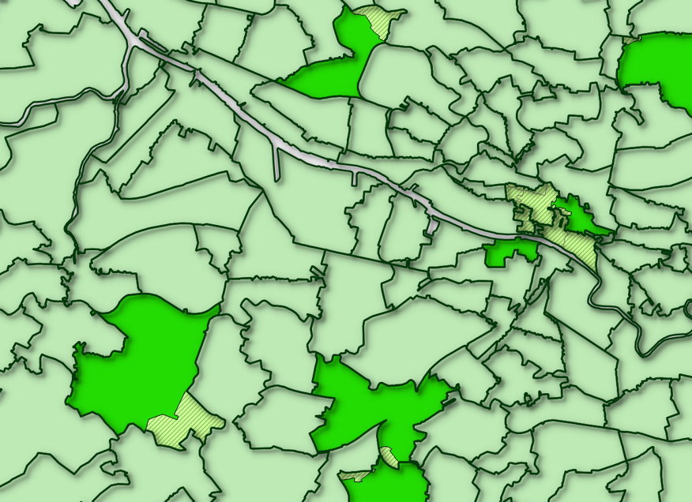

# Overview

This repo contains harmonised UK Census **country of birth (CoB)** data
for Great Britain, plus other supporting files and code. This page
explains what the data is, how it’s made, what the rationale is, and
what the various other files are.

# Quick start

If you just want to use the data, here’s what you need. There are
**four** different country of birth CSVs:

-   Separate CSVs for Great Britain and Scotland. Separate Scotland CSVs
    are included as they have a few more country of birth categories
    (due to differences in 2011 Scottish CoBs).
-   For each of those:
    -   3 Census data, 1991, 2001 and 2011 (much larger list of CoBs)
    -   5 Census data, 1971 to 2011 (smaller list of CoBs)

Direct links to the files:

-   Great Britain:
    -   [3
        Census](data/countryofbirth/countryOfBirth_GreatBritain_3_Census.csv)
    -   [5
        Census](data/countryofbirth/countryOfBirth_GreatBritain_5_Census.csv)
-   Scotland:
    -   [3
        Census](data/countryofbirth/countryOfBirth_Scotland_3_Census.csv)
    -   [5
        Census](data/countryofbirth/countryOfBirth_Scotland_5_Census.csv)

Each CSV contains all Census years in long form. To get them, either
[clone the repo](https://git-scm.com/docs/git-clone) or follow the above
links and right-click on the download button for download options.

The CoBs available in these are:

**Great Britain 3 Census (1991/2001/2011)**

     [1] "Channel Islands"       "UK part not specified" "Irish Republic"       
     [4] "South Africa"          "Africa other"          "Caribbean"            
     [7] "South America"         "Other Middle East"     "Other EU members"     
    [10] "Other Europe"          "Rest of World"         "England"              
    [13] "Scotland"              "Wales"                 "Northern Ireland"     
    [16] "Australia"             "Kenya"                 "Zimbabwe"             
    [19] "Nigeria"               "Bangladesh"            "India"                
    [22] "Pakistan"              "Hong Kong"             "France"               
    [25] "Germany"               "Italy"                 "Spain"                
    [28] "Poland"                "Romania"               "Turkey"               
    [31] "United States"         "Iran"                  "China"                

**Great Britain 5 Census (1971-2011)**

    [1] "England"        "Scotland"       "Wales"          "Irish Republic"
    [5] "Rest of UK"     "India"          "Pakistan"       "Europe"        
    [9] "Rest of world" 

**Scotland 3 Census**

     [1] "Channel Islands"       "UK part not specified" "Irish Republic"       
     [4] "China"                 "South Africa"          "Africa other"         
     [7] "Caribbean"             "South America"         "Other Middle East"    
    [10] "Other East Asia"       "Other Europe"          "Rest of World"        
    [13] "England"               "Scotland"              "Wales"                
    [16] "Northern Ireland"      "Australia"             "Canada"               
    [19] "New Zealand"           "Kenya"                 "Zimbabwe"             
    [22] "Nigeria"               "Bangladesh"            "India"                
    [25] "Pakistan"              "Hong Kong"             "Malaysia"             
    [28] "Singapore"             "France"                "Germany"              
    [31] "Greece"                "Italy"                 "Netherlands"          
    [34] "Spain"                 "Poland"                "Romania"              
    [37] "Turkey"                "United States"         "Iran"                 

**Scotland 5 Census**

     [1] "England"                      "Scotland"                    
     [3] "Wales"                        "Rest of UK"                  
     [5] "Irish Republic"               "Old Commonwealth"            
     [7] "Africa New Commonwealth"      "India"                       
     [9] "Pakistan"                     "Europe"                      
    [11] "S East Asia New Commonwealth" "Caribbean New Commonwealth"  
    [13] "New Commonwealth other"       "Rest of world"               

### Geography

There’s a zipped up shapefile in the data folder that matches the
**zone** field in the CSVs. It also contains columns for country
(England/Scotland/Wales) and [Travel to Work
Area](https://www.ons.gov.uk/employmentandlabourmarket/peopleinwork/employmentandemployeetypes/articles/traveltoworkareaanalysisingreatbritain/2016).
This is an edited version of 1991 wards/postcode sectors, designed to
deal with disclosure issues that removed 1991 data (see below for a full
explanation, including the ‘merges’ column).

An example of this in use, using R:

``` r
library(tidyverse)
library(sf)
library(tmap)

#Includes counts for each country of birth per ward, for each Census from 1971 to 2011
gb5 <- read_csv('data/countryofbirth/countryOfBirth_GreatBritain_5_Census.csv')

#Make % zone proportions so we have percent of CoB per zone
props <- gb5 %>%
  mutate(rowsums = rowSums(across(England:`Rest of world`))) %>% #Get total count of people per ward
  mutate(across(England:`Rest of world`, ~((.)/rowsums)*100, .names = "percent_{.col}")) %>% #Covert each to percentage, keep original columns
  select(-rowsums)

#Add a column for total percent of non-UK-born
props <- props %>%
  mutate(nonUK = `percent_Irish Republic`+percent_India+percent_Pakistan+percent_Europe+`percent_Rest of world`)

#Load shapefile
#Unzip first if you haven't already
unzip('data/gb_shapefile/gb_shapefile.zip', exdir = 'data/gb_shapefile')

zones <- st_read('data/gb_shapefile/gb_altered_wards_n_postcodesectors_w_lookup.shp')

#Merge spatial zones with CoB data
#If merging with spatial data, put spatial first to keep as sf
join <- left_join(zones,props,by='zone')

#Subset to London TTWA
london <- join %>% filter(ttwa == 'London')

#facet map of London data for non-UK-born
tm_shape(london) +
  tm_polygons(col = 'nonUK', style = 'fisher', n = 12, palette = 'plasma') +
  tm_facets(by = 'censusYear', ncol = 1) 
```

A gif version of the map the above codes produces (see the [rmarkdown
file for the gif
code](https://raw.githubusercontent.com/DanOlner/HarmonisedCountryOfBirthDatasets/master/README.Rmd)):


# More detail

### The harmonised country of birth data

The aim of this dataset is to maximise the number of country of birth
categories while keeping them identical across Censuses. UK Census data
provides tables for people’s country of birth with digital access going
back to 1971. (See below for more on original data sources.) But neither
the geographical zones used **or** the CoB categories are consistent
between Censuses. This dataset gives a consistent version, providing an
identical geography and CoB category list between Censuses.

The ‘lowest common denominator’ set of countries each Census has in
common is used. The Census with the fewest categories imposes its
structure on others that may have a more detailed list. Both the 1971
and 1981 Censuses contain a much smaller number - so harmonising across
five Censuses restricts the overall number. 1971 also has a rather
colonial structure, with country groups categorised into Commonwealth
groups.

Assignment of countries has been made via a careful reading of the
country of birth categories in the various Census definition documents.
These have all been included as a zip file in the docs folder.

Code is supplied that shows the workings. The code in
[scotland\_3censusHarmonise](code/scotland_3censusHarmonise.R) is a good
example. Where exact matches can be found across all three Censuses
(once any differences in naming are dealt with) these are kept. For
groups of countries, a function re-assigns/sums according to column.

### Altered geographical zones used for the dataset

A quirk in how the 1991 Census reports country of birth led to the
choice of geography. An altered version of 1991 wards (for England and
Wales) and postcode sectors (for Scotland) is used. The 1991 Census has
SAS (small area statistics) and LBS (local base statistics) tables. The
1991 **LBS** tables - available at ward/pcs level - contain a much
larger list of CoB categories than the SAS tables. As the name suggests,
the SAS tables are for small areas, and have disclosure issues that
reduced the number of CoBs. Using the LBS table makes it possible to
create a larger list of CoBs for 1991/2001 and 2011, and to make a
consistent 5-Census dataset from 1971 (though with far fewer
categories).

The 1991 LBS tables, however, have another issue: disclosure conditions
mean that postcode sectors with a population less than a thousand or
household numbers lower than 320 have their counts set to zero. In the
1991 LBS tables, these zero counts have been added to contiguous
zones[1] - this actually provides a way to address the problem. If the
zero-count geographical boundary is merged with its contiguous neighbour
where the counts have been re-assigned, a new larger boundary zone can
be created and used instead.

The correct neighbour zones can be identified by comparing population
counts between the LBS and SAS tables: SAS tables have the correct count
where the LBS tables are set to zero; the correct neighbour zone can be
identified by subtracting this count from the LBS population count table
and checking for a match against its SAS value. The following map
illustrates the result of this process for some zero-count zones in
Glasgow, also illustrating how two or more zero-count zones are
sometimes assigned to a single contiguous neighbour. This can mostly be
done via script, though some odd mismatches needed tidying up by hand.



Wards and postcode sectors are large enough that most smaller zones for
1971/81/2001/2011 fit inside. For overlapping zones, a simple area
re-assign is used.

The code for the reassigns is in the **code** folder, in three scripts:
one for [Scotland](code/1991LBS_zeroCount_reassignment_Scotland.R), one
for [England and
Wales](code/1991LBS_zeroCount_reassignment_EnglandWales.R), and
[another](code/createFinalGB_1991LBSzone_edit.R) that joins these two
and does a little extra fixing. It won’t work without a number of other
files but is supplied to show workings. (Get in touch for more info, see
email below.)

### Data linkage

Because a bespoke geography is used, for any new data sources to match
the CoB data geography, they also need to be assigned to this new
geography before they can be linked. [5 Census data for **‘economically
active’**](data/economicallyactive/economicallyActive_GreatBritain_5_Census.csv)
is included in the repo as an example, including a per-zone *%
unemployed* column. The code for producing this data sheet [is
included](code/econActive_CensusVariableProcessing.R).

The process requires an intersect geography for each Census year apart
from 1991. These can be [downloaded in zip form from
here](http://ubdc.gla.ac.uk/dataset/395a865d-ff06-4c05-9964-949b5097b845/resource/2ea76b98-4275-4e3e-959f-5b9ab167e042/download/greatbritain5censusintersects.zip)
and will unzip to \~2gb. As the script shows, 1991 reassignment only
needs a record of what the original 91 LBS zones were. These are in the
geography shapefile as the **merge** column. This contains a
bar-separated list of any merged zones; the script uses this to sum
them.

# Data sources

### Country of birth / Census data

-   England/Wales/Scotland data up to 2001:
    [CASWEB](http://casweb.ukdataservice.ac.uk/).

-   England and Wales 2011:
    [NOMIS](https://www.nomisweb.co.uk/census/2011).

-   Scotland 2011: [Scotland’s
    Census](http://www.scotlandscensus.gov.uk/).

-   Geographies: [UK Data Service
    Borders](https://borders.ukdataservice.ac.uk/bds.html).

All of these data sources are covered by the [Open Government
License](http://www.nationalarchives.gov.uk/doc/open-government-licence/version/3/),
which allows adaptation of data sources.

### Contact:

Much of the included code is not pretty, but I’ve attempted to include
everything necessary to be able to recreate the process. If anyone does
actually want to attempt to do this and gets stuck, please get in touch
(dolner at gmail dot com).

[1] Office of Population Censuses, 1992. 1991 Census, definitions Great
Britain. HMSO, London.
